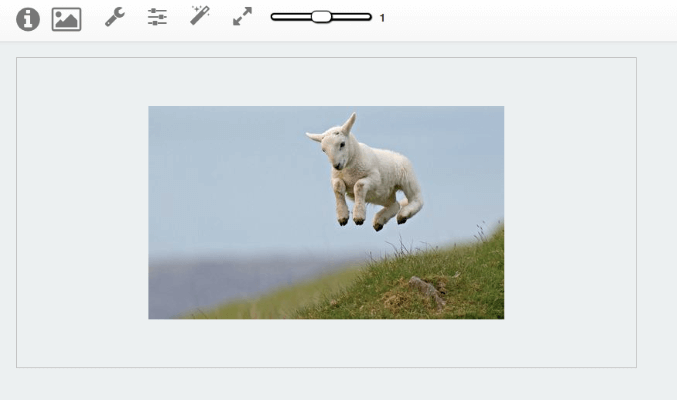

# Masters Thesis Project - 2015

This projects aims to study and try verify what was possible for image manipulation on web browsers

### Features:

- Upload image
- download image
- use sample image
- capture image via webcam
- Zoom (In / out )
- rotate image
- Flip horizontal
- Fip Vertical
- Filters: Blur, brightness, Clip, Gamma, Hue, etc...
- Effects: Vintage, Sunrise, Greyscale, etc...

### Frameworks | Libraries | API:

- Twitter Bootstrap: v3
- jquery: v1
- jquery UI: v1.11.2 
- HammerJS: v2.0.4 
- CamanJS: v3
- Canvas API (browser )

***Note***: With evolution of web API on browser few feature may not work like capture image via webcam

### Image

